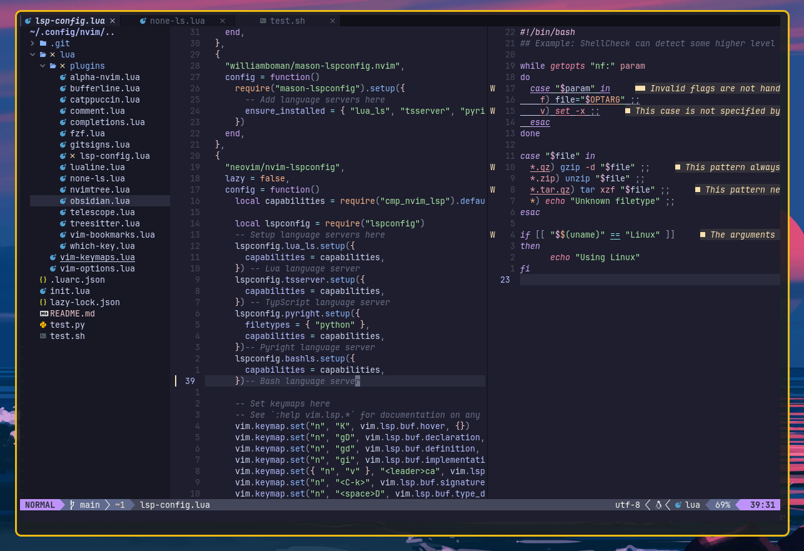

# NEOVIM - Typecraft
<!-- ``` -->
<!---->
<!--                                   __ -->
<!--      ___     ___    ___   __  __ /\_\    ___ ___ -->
<!--     / _ `\  / __`\ / __`\/\ \/\ \\/\ \  / __` __`\ -->
<!--    /\ \/\ \/\  __//\ \_\ \ \ \_/ |\ \ \/\ \/\ \/\ \ -->
<!--    \ \_\ \_\ \____\ \____/\ \___/  \ \_\ \_\ \_\ \_\ -->
<!--     \/_/\/_/\/____/\/___/  \/__/    \/_/\/_/\/_/\/_/ -->
<!-- ``` -->


[Built from Typecraft 0 to IDE](https://www.youtube.com/watch?v=zHTeCSVAFNY&list=PLsz00TDipIffreIaUNk64KxTIkQaGguqn&ab_channel=typecraft)

Using [Neovim0.9.4](https://github.com/neovim/neovim/releases/tag/v0.9.4)

[lazy.nvim package manager](https://github.com/folke/lazy.nvim)

### Plugins

- [lazy.nvim](https://github.com/folke/lazy.nvim)
  - Amazing plugin manager for Neovim
- [alpha-nvim](https://github.com/goolord/alpha-nvim)
  - Welcome screen greeter
- [bufferline](https://github.com/akinsho/bufferline.nvim)
  - Snazzy tabs to show buffers
- [catppuccin](https://github.com/catppuccin/catppuccin)
  - Best theme ever
- [comment.nvim](https://github.com/numToStr/Comment.nvim)
    - Comment lines
- completions
  - [nvim-cmp](https://github.com/hrsh7th/nvim-cmp)
    - A completion engine plugin
  - [cmp-nvim-lsp](https://github.com/hrsh7th/cmp-nvim-lsp)
    - nvim lsp completion source. Merges different completion results with nvm cmp
  - [luasnip](https://github.com/L3MON4D3/LuaSnip)
    - Snippet completion source
    - vs-code like snippets
- [fzf.nvim](https://github.com/junegunn/fzf.vim)
  - Fuzzy finder wrapper for nvim
- lsp-config
  - [mason.nvim](https://github.com/williamboman/mason.nvim)
    - Package manager
    - Easily install LSPs, linters, and formatters
  - [mason-lspconfig](https://github.com/williamboman/mason-lspconfig.nvim)
    - Closes some gaps between mason.nvim and lspconfig
    - Ensure_installed language servers
  - [nvim-lspconfig](https://github.com/neovim/nvim-lspconfig)
    - Configurations for LSP clients
    - Set keymaps shortcuts for diagnostics, buffer hints
- [lualine](https://github.com/nvim-lualine/lualine.nvim)
  - status line
- [none-ls](https://github.com/nvimtools/none-ls.nvim)
  - Inject diaognstics and formatters into LSP
- [nvimtree](https://github.com/nvim-tree/nvim-tree.lua)
  - A sidebar file explorer
- [osbidian](https://github.com/epwalsh/obsidian.nvim)
  - Obsidian plugin to write and navigate vaults
- [telescope](https://github.com/nvim-telescope/telescope.nvim)
  - Highly extendable fuzzy finder
- [treesitter](https://github.com/nvim-treesitter/nvim-treesitter)
  - Parse generator tool to build syntax trees
- [which-key](https://github.com/folke/which-key.nvim)
  - Displays a popup with possible key bindings of the command you started typing

** pyright - installing npm
- https://github.com/nvm-sh/nvm?tab=readme-ov-file#installing-and-updating
    - curl -o- https://raw.githubusercontent.com/nvm-sh/nvm/v0.39.7/install.sh | bash
    - nvm ls -remote
    - nvm install v21.7.0

### LSP key bindings


- "n",      "K", vim.lsp.buf.hover, {})
- "n",      "gD", vim.lsp.buf.declaration, {})
- "n",      "gd", vim.lsp.buf.definition, {})
- 'n',      "ge", vim.diagnostic.open_float)
- "n",      "gi", vim.lsp.buf.implementation, {})
- 'n',      "gs", vim.diagnostic.show)
- "n",      "<space>D", vim.lsp.buf.type_definition, {})
- "n", "v"  "<leader>ca", vim.lsp.buf.code_action, {})


